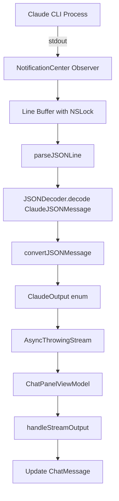
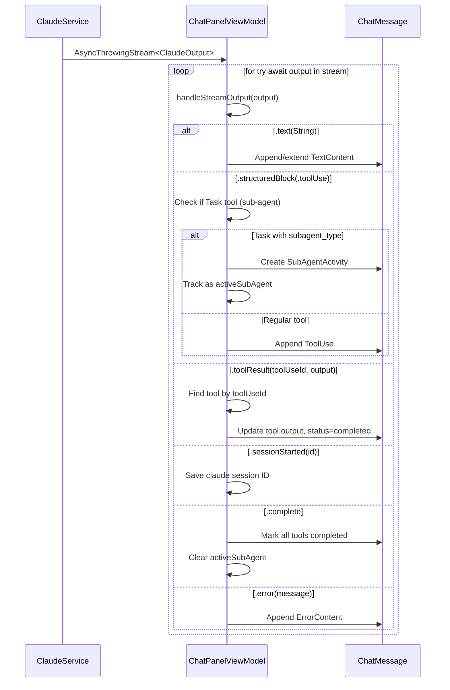

# Claude Streamed JSON Parsing

This document describes how the macOS app parses Claude CLI's streamed JSON output (NDJSON format).

## Overview



## Output Format

Claude CLI uses `--output-format stream-json` which produces **NDJSON** (Newline-Delimited JSON). Each line is a complete JSON object representing a message event.

Example stream:
```json
{"type":"system","subtype":"init","session_id":"abc123"}
{"type":"assistant","message":{"role":"assistant","content":[{"type":"text","text":"Hello!"}]}}
{"type":"assistant","message":{"role":"assistant","content":[{"type":"tool_use","id":"toolu_01","name":"Read","input":{"file_path":"/foo.txt"}}]}}
{"type":"user","message":{"role":"user","content":[{"type":"tool_result","tool_use_id":"toolu_01","content":"file contents..."}]}}
{"type":"result","result":{"role":"assistant","content":[{"type":"text","text":"Done!"}]}}
```

## Main Files

| File | Purpose |
|------|---------|
| `ClaudeService.swift` | Spawns Claude process, reads stdout, parses JSON lines |
| `ClaudeModels.swift` | Data structures for JSON decoding and parsed output |
| `ChatPanelViewModel.swift` | Consumes stream, updates UI state, correlates tool results |
| `ToolInputParser.swift` | Parses tool input JSON parameters |

## Data Structures

### ClaudeOutput (Output of Parsing)

The main enum representing parsed output from the JSON stream:

```swift
enum ClaudeOutput {
    case text(String)                                    // Plain text from assistant
    case structuredBlock(MessageContent)                 // Structured content (tool use, etc.)
    case prompt(AskUserQuestion)                        // Interactive question for user
    case sessionStarted(String)                         // Session ID from init message
    case toolResult(toolUseId: String, output: String)  // Tool execution result
    case complete                                        // Stream finished successfully
    case error(String)                                   // Error message
}
```

### ClaudeJSONMessage (Raw JSON Input)

The root structure for decoding each JSON line:

```swift
struct ClaudeJSONMessage: Decodable {
    let type: String           // "system", "assistant", "user", "result"
    let subtype: String?       // "init" for system messages
    let sessionId: String?     // Session ID (from system/init)
    let message: ClaudeMessageBody?
    let toolUseId: String?
    let name: String?
    let input: AnyCodable?
    let result: ClaudeResultBody?   // Result as object
    let resultString: String?       // Result as plain string (from sub-agents)
    let isError: Bool?
    // ... cost, duration metrics
}
```

### MessageContent (UI Display)

The content types that can appear in a chat message:

```swift
enum MessageContent {
    case text(TextContent)
    case codeBlock(CodeBlock)
    case askUserQuestion(AskUserQuestion)
    case todoList(TodoList)
    case fileChange(FileChange)
    case toolUse(ToolUse)
    case subAgentActivity(SubAgentActivity)
    case error(ErrorContent)
    case eventPayload(EventPayload)
}
```

### ToolUse

Represents a tool invocation:

```swift
struct ToolUse {
    let toolUseId: String?     // ID for correlating with tool_result
    let toolName: String       // "Read", "Bash", "Task", etc.
    let input: String?         // JSON string of parameters
    var output: String?        // Populated when tool_result arrives
    var status: ToolStatus     // .running → .completed/.failed
}
```

## Parsing Flow

### 1. Process Setup (ClaudeService.swift:113-142)

```swift
let process = Process()
process.executableURL = URL(fileURLWithPath: "/bin/zsh")
process.arguments = ["-l", "-c", claudeCmd]  // Login shell for PATH

// Command includes:
// -p "message"                    Prompt/message
// --output-format stream-json     NDJSON output
// --verbose                       Required with stream-json
// -r <session_id>                 Resume session (optional)
// --model <model>                 Model selection (optional)
// --allowedTools <list>           Pre-approved tools
```

### 2. Stream Reading with NotificationCenter (ClaudeService.swift:174-255)

Uses classic Cocoa pattern for async file handle reading:

```swift
let lock = NSLock()
var lineBuffer = ""

stdoutObserver = NotificationCenter.default.addObserver(
    forName: .NSFileHandleDataAvailable,
    object: stdoutHandle,
    queue: nil
) { _ in
    let data = stdoutHandle.availableData

    if let text = String(data: data, encoding: .utf8) {
        lock.lock()
        lineBuffer += text

        // Process complete lines
        while let newlineIndex = lineBuffer.firstIndex(of: "\n") {
            let line = String(lineBuffer[..<newlineIndex])
            lineBuffer = String(lineBuffer[lineBuffer.index(after: newlineIndex)...])
            lock.unlock()

            // Parse outside lock
            if let output = self.parseJSONLine(trimmed) {
                continuation.yield(output)
            }
            lock.lock()
        }
        lock.unlock()
    }

    stdoutHandle.waitForDataInBackgroundAndNotify()
}
```

### 3. JSON Line Parsing (ClaudeService.swift:337-359)

```swift
private func parseJSONLine(_ line: String) -> ClaudeOutput? {
    guard let data = line.data(using: .utf8) else { return nil }

    do {
        let message = try JSONDecoder().decode(ClaudeJSONMessage.self, from: data)
        return convertJSONMessage(message)
    } catch {
        // Filter protocol JSON that failed to parse
        if isProtocolJSON(line) {
            return nil
        }
        // Fallback: treat as plain text
        return .text(line)
    }
}
```

### 4. Message Type Conversion (ClaudeService.swift:362-463)

```swift
private func convertJSONMessage(_ message: ClaudeJSONMessage) -> ClaudeOutput? {
    switch message.type {
    case "system":
        // Extract session_id from init message
        if message.subtype == "init", let sessionId = message.sessionId {
            return .sessionStarted(sessionId)
        }
        return nil

    case "assistant":
        // Parse content blocks
        if let contentBlocks = message.message?.content {
            // Text blocks → .text(String)
            let textParts = contentBlocks.compactMap { block -> String? in
                if block.type == "text" { return block.text }
                return nil
            }
            if !textParts.isEmpty {
                return .text(textParts.joined())
            }

            // Tool use blocks → .structuredBlock(.toolUse(...))
            for block in contentBlocks {
                if block.type == "tool_use", let name = block.name {
                    // Special handling for AskUserQuestion
                    if name == "AskUserQuestion", let input = block.input {
                        if let question = parseAskUserQuestion(from: input) {
                            return .prompt(question)
                        }
                    }

                    let toolUse = ToolUse(
                        toolUseId: block.toolUseId,
                        toolName: name,
                        input: block.input?.jsonString,
                        status: .running
                    )
                    return .structuredBlock(.toolUse(toolUse))
                }
            }
        }
        return nil

    case "user":
        // Tool results - correlate with tool_use_id
        if let contentBlocks = message.message?.content {
            for block in contentBlocks {
                if block.type == "tool_result", let toolUseId = block.toolUseId {
                    return .toolResult(toolUseId: toolUseId, output: block.content ?? "")
                }
            }
        }
        return nil

    case "result":
        // Final result - can be string or object
        if let resultString = message.resultString, !resultString.isEmpty {
            return .text(resultString)
        }
        if let resultContent = message.result?.content {
            let textParts = resultContent.compactMap { $0.text }
            if !textParts.isEmpty {
                return .text(textParts.joined())
            }
        }
        if message.isError == true, let content = message.content {
            return .error(content)
        }
        return nil

    default:
        return nil
    }
}
```

## Stream Consumption (ChatPanelViewModel)

### Sequence Diagram



### Tool Result Correlation

When a tool result arrives, it's matched to the original tool invocation by `toolUseId`:

```swift
case .toolResult(let toolUseId, let resultOutput):
    handleToolResult(toolUseId: toolUseId, output: resultOutput, msgIndex: msgIndex)

private func handleToolResult(toolUseId: String, output: String, msgIndex: Int) {
    // First check active sub-agent's tools
    if let active = activeSubAgent,
       active.messageIndex == msgIndex,
       case .subAgentActivity(var subAgent) = messages[msgIndex].content[active.contentIndex] {
        if let toolIndex = subAgent.tools.firstIndex(where: { $0.toolUseId == toolUseId }) {
            subAgent.tools[toolIndex].output = output
            subAgent.tools[toolIndex].status = .completed
            messages[msgIndex].content[active.contentIndex] = .subAgentActivity(subAgent)
            return
        }
    }

    // Then check top-level tools
    for (contentIndex, content) in messages[msgIndex].content.enumerated() {
        if case .toolUse(var toolUse) = content, toolUse.toolUseId == toolUseId {
            toolUse.output = output
            toolUse.status = .completed
            messages[msgIndex].content[contentIndex] = .toolUse(toolUse)
            return
        }
    }
}
```

### Sub-Agent (Task Tool) Handling

When Claude invokes the `Task` tool with a `subagent_type`, child tools are grouped:

```swift
if newToolUse.toolName == "Task" {
    let parser = ToolInputParser(newToolUse.input)
    if let subagentType = parser.subagentType {
        let subAgentActivity = SubAgentActivity(
            parentToolUseId: newToolUseId,
            subagentType: subagentType,      // "Explore", "Plan", etc.
            description: parser.taskDescription ?? "Running sub-agent",
            tools: [],                        // Child tools added here
            status: .running
        )
        messages[msgIndex].content.append(.subAgentActivity(subAgentActivity))
        activeSubAgent = (messageIndex: msgIndex, contentIndex: contentIndex, toolUseId: newToolUseId)
    }
}

// Subsequent tools get added to active sub-agent
if let active = activeSubAgent, newToolUse.toolName != "Task" {
    if case .subAgentActivity(var subAgent) = messages[msgIndex].content[active.contentIndex] {
        subAgent.tools.append(newToolUse)
        messages[msgIndex].content[active.contentIndex] = .subAgentActivity(subAgent)
    }
}
```

## Type-Erased JSON Handling

The `AnyCodable` struct handles arbitrary JSON in tool inputs:

```swift
struct AnyCodable: Decodable, Hashable {
    let value: Any

    init(from decoder: Decoder) throws {
        let container = try decoder.singleValueContainer()

        if let string = try? container.decode(String.self) {
            value = string
        } else if let int = try? container.decode(Int.self) {
            value = int
        } else if let dict = try? container.decode([String: AnyCodable].self) {
            value = dict.mapValues { $0.value }
        } else if let array = try? container.decode([AnyCodable].self) {
            value = array.map { $0.value }
        } else {
            value = NSNull()
        }
    }

    var jsonString: String {
        if let dict = value as? [String: Any],
           let data = try? JSONSerialization.data(withJSONObject: dict, options: .prettyPrinted),
           let string = String(data: data, encoding: .utf8) {
            return string
        }
        return String(describing: value)
    }
}
```

## Error Handling

### JSON Parse Failures

```swift
} catch {
    // Filter protocol JSON that should have been parsed
    if isProtocolJSON(line) {
        return nil  // Suppress, don't show as text
    }
    return .text(line)  // Fallback to plain text
}

private func isProtocolJSON(_ line: String) -> Bool {
    let patterns = [
        "{\"type\":\"user\"",
        "{\"type\":\"system\"",
        "{\"type\":\"assistant\"",
        "{\"type\":\"result\""
    ]
    return patterns.contains { line.contains($0) }
}
```

### Resilient Content Block Decoding

Content blocks are decoded individually to survive malformed entries:

```swift
init(from decoder: Decoder) throws {
    if var contentContainer = try? container.nestedUnkeyedContainer(forKey: .content) {
        var blocks: [ClaudeContentBlock] = []
        while !contentContainer.isAtEnd {
            if let block = try? contentContainer.decode(ClaudeContentBlock.self) {
                blocks.append(block)
            } else {
                // Skip malformed block
                _ = try? contentContainer.decode(AnyCodable.self)
            }
        }
        content = blocks.isEmpty ? nil : blocks
    }
}
```

### Process Termination

```swift
process.terminationHandler = { proc in
    // Read any remaining buffered data
    if let remaining = try? stdoutHandle.readToEnd(), !remaining.isEmpty {
        for line in text.components(separatedBy: "\n") {
            if let output = self.parseJSONLine(trimmed) {
                continuation.yield(output)
            }
        }
    }

    if proc.terminationStatus == 0 {
        continuation.yield(.complete)
        continuation.finish()
    } else {
        continuation.finish(throwing: ClaudeError.processFailed(
            proc.terminationStatus,
            stderrBuffer
        ))
    }
}
```

## Thread Safety

| Mechanism | Purpose |
|-----------|---------|
| `NSLock` | Protects line buffer during concurrent stdout/stderr reads |
| `MainActor.run` | UI updates happen on main thread |
| `Task.detached` | Process I/O runs off main thread |

```swift
for try await output in stream {
    await MainActor.run {
        handleStreamOutput(output, messageId: messageId, ...)
    }
}
```

## Summary

| Stage | Input | Output |
|-------|-------|--------|
| Process stdout | Raw bytes | String lines |
| `parseJSONLine` | JSON string | `ClaudeOutput?` |
| `convertJSONMessage` | `ClaudeJSONMessage` | `ClaudeOutput` |
| `handleStreamOutput` | `ClaudeOutput` | UI state updates |

Key features:
- **NDJSON streaming** - Each line is independent JSON
- **Tool correlation** - Results matched by `tool_use_id`
- **Sub-agent grouping** - Task tool children grouped under parent
- **Resilient parsing** - Malformed blocks skipped, fallback to text
- **Thread-safe buffering** - NSLock for concurrent reads
