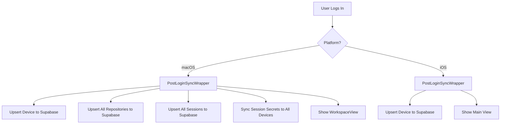
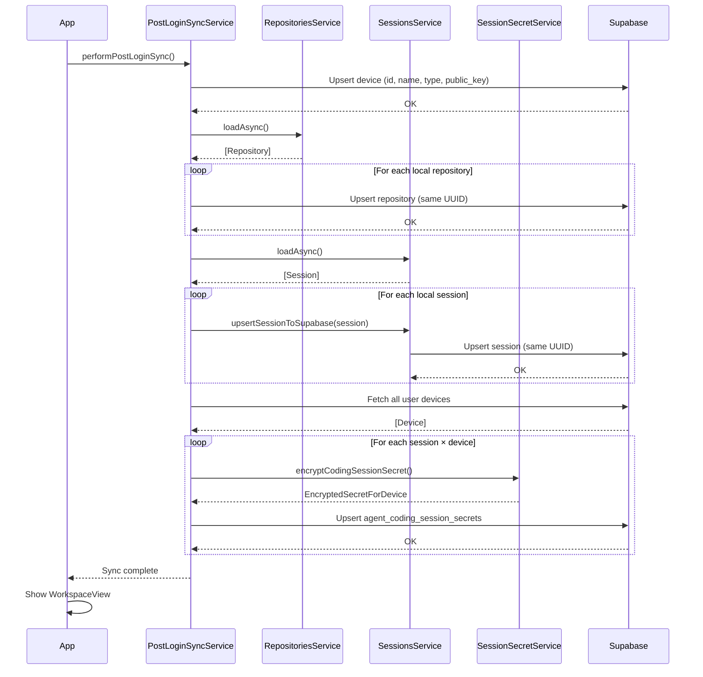
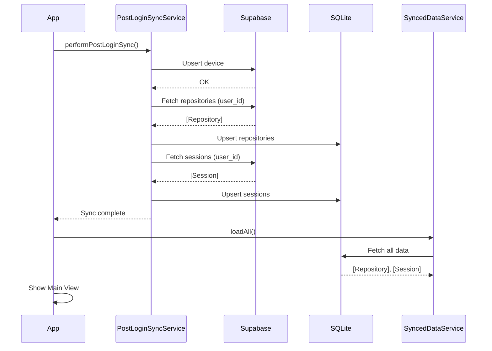

# Post-Login Sync Flow

This document describes the synchronization that occurs when users
log into the iOS and macOS apps.

## Overview



## macOS Sync Flow

### Sequence Diagram



### What Gets Synced (macOS)

**Device Details:**
- Device ID, name, type (mac-desktop)
- Hostname, public key
- Trust status, last seen timestamp

**Repositories (repositories):**
- Repository ID (same as local UUID)
- User ID, device ID
- Name, local path
- Remote URL, default branch
- Status (active)

**Sessions (agent_coding_sessions):**
- Session ID (same as local UUID)
- Repository ID (FK to repositories), user ID, device ID
- Status, timestamps
- Worktree info (is_worktree, worktree_path)

**Session Secrets (agent_coding_session_secrets):**
- Session ID
- Device ID (target device)
- Encrypted secret (X25519 ECDH + ChaChaPoly hybrid encryption)

The session secrets allow other trusted devices to decrypt session messages.
Each secret is encrypted specifically for a target device using hybrid encryption:
1. Generate ephemeral X25519 keypair
2. Derive shared secret via ECDH with device's public key
3. Use HKDF to derive symmetric key
4. Encrypt session secret with ChaChaPoly AEAD

**NOT Synced:**
- Session messages (encrypted, stored separately via relay)
- File contents

### Code Structure

```swift
// PostLoginSyncService.swift (macOS)
@Observable
final class PostLoginSyncService {
    func performPostLoginSync() async {
        // Step 1: Ensure device is registered
        await syncDevice()

        // Step 2: Load local sessions
        try await sessionsService.loadAsync()

        // Step 3: Sync all local sessions to Supabase
        await syncAllSessions()

        // Step 4: Sync session secrets to all user devices
        await syncAllSessionSecrets()
    }

    private func syncAllSessions() async {
        for session in sessionsService.sessions {
            try await sessionsService.upsertSessionToSupabase(
                session: session,
                userId: userId,
                deviceId: deviceId
            )
        }
    }

    private func syncAllSessionSecrets() async {
        let devices = await fetchUserDevices(userId: userId)
        let targetDevices = devices.filter { $0.publicKey != nil && $0.id != currentDeviceId }

        for session in sessionsService.sessions {
            for device in targetDevices {
                // Encrypt session secret for this device using hybrid encryption
                let encrypted = try SessionSecretService.shared.encryptCodingSessionSecret(
                    sessionSecret: sessionSecret,
                    devicePublicKey: device.publicKey!,
                    sessionId: session.id
                )
                // Upsert to agent_coding_session_secrets
                try await supabase.from("agent_coding_session_secrets")
                    .upsert(secretRecord, onConflict: "session_id,device_id")
                    .execute()
            }
        }
    }
}
```

### Wrapper View

```swift
// PostLoginSyncWrapper.swift (macOS)
struct PostLoginSyncWrapper<Content: View>: View {
    @State private var syncService: PostLoginSyncService?
    @State private var hasSynced = false

    var body: some View {
        Group {
            if hasSynced {
                content()
            } else {
                syncingView  // Progress indicator
            }
        }
        .task {
            await performSync()
        }
    }
}
```

## iOS Sync Flow

iOS pulls repositories and sessions FROM Supabase INTO local SQLite (opposite of macOS).

### Sequence Diagram



### What Gets Synced (iOS)

**Device Details (push to Supabase):**
- Device ID, name, type (ios-phone/ios-tablet)
- Hostname (device name)
- APNs token and environment
- Trust status, public key

**Repositories (pull from Supabase → SQLite):**
- Repository ID, name, path
- Default branch, remote URL
- Timestamps

**Sessions (pull from Supabase → SQLite):**
- Session ID, repository ID
- Status, worktree path
- Timestamps

### Code Structure

```swift
// PostLoginSyncService.swift (iOS)
@Observable
final class PostLoginSyncService {
    func performPostLoginSync() async {
        // Step 1: Push device details to Supabase
        await syncDevice()

        // Step 2: Pull repositories from Supabase → SQLite
        await syncRepositoriesFromSupabase()

        // Step 3: Pull sessions from Supabase → SQLite
        await syncSessionsFromSupabase()
    }
}

// SyncedDataService.swift (iOS)
@Observable
final class SyncedDataService {
    static let shared = SyncedDataService()

    var repositories: [SyncedRepository] = []
    var sessions: [SyncedSession] = []

    func loadAll() async {
        // Load from SQLite for UI display
        repositories = try await databaseService.repositories.fetchAll()
        sessions = try await databaseService.sessions.fetchAll()
    }
}
```

## Integration Points

### macOS ContentView

```swift
// ContentView.swift
@ViewBuilder
private var authenticatedContent: some View {
    PostLoginSyncWrapper {
        // Main app content (WorkspaceView, SettingsView)
    }
    .sheet(item: $trustStatusService) { ... }
    .task { await checkTrustOnboarding() }
}
```

### iOS App

```swift
// unbound_iosApp.swift
@ViewBuilder
private var authenticatedContent: some View {
    PostLoginSyncWrapper {
        // Main app content (NavigationStack, DeviceListView)
    }
    .task {
        await connectToRelay()
        await checkTrustOnboarding()
    }
}
```

## Progress UI

Both platforms show a progress indicator during sync:

```
[=========>          ] 50%
Syncing sessions...
```

If sync fails, users can continue anyway:

```
Sync error: Network error
[Continue Anyway]
```

## Error Handling

| Platform | Error | Behavior |
|----------|-------|----------|
| macOS | Device sync fails | Log, continue with sessions |
| macOS | Session sync fails | Log, continue with next session |
| macOS | Secret sync fails | Log, continue with next device/session |
| iOS | Device sync fails | Log, continue to main view |
| Both | All sync fails | Show error, allow "Continue Anyway" |
